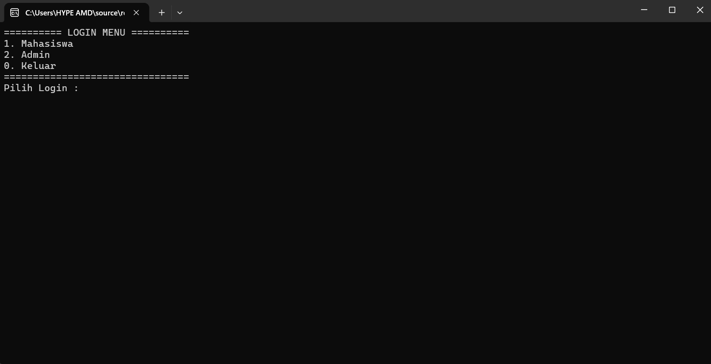
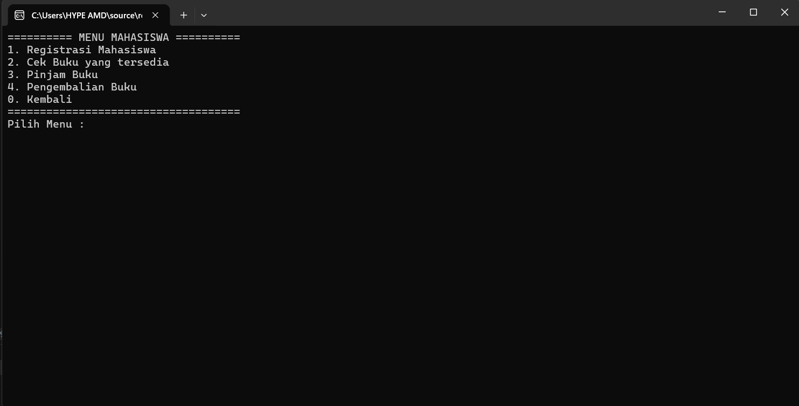
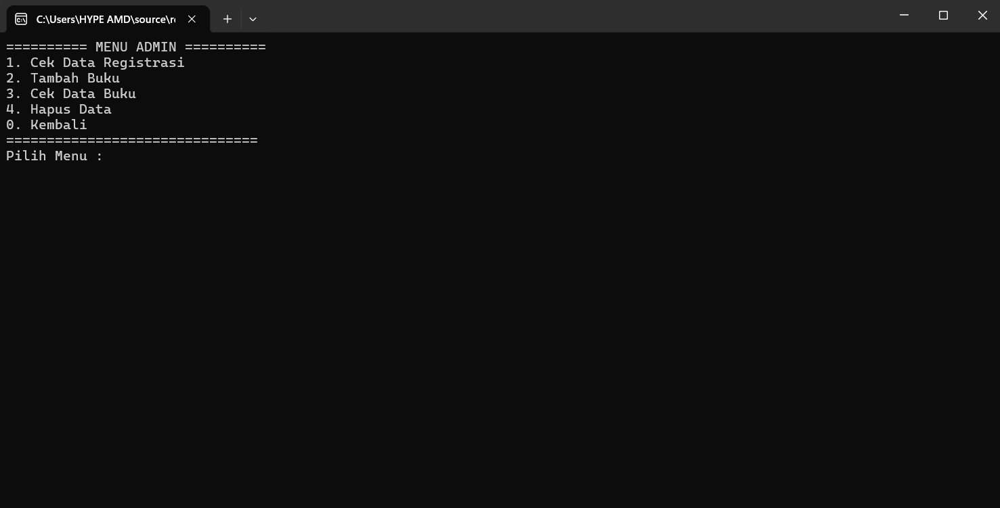

# Project Akhir Semester 2 - Teknik Informatika

## Informasi

Tugas besar ini merupakan implementasi **Struktur Data dan Algoritma (Data Structures and Algorithms / DSA)** untuk memenuhi syarat **Penilaian Akhir Semester 2**.

- Mata Kuliah : **Algoritma dan Struktur data**
- Dosen Mata Kuliah : **Venny Ponggawa, SST, M,T**
- Topik : Pembuatan **Aplikasi Perpustakaan Berbasis CLI (Command Line Interface)**

---

## Mahasiswa Teknik Informatika

- **Marvin Letunaung** | 25024128
- **Christian Mandalika** | 25024126

---

## Tampilan Aplikasi

### Menu Awal

### Menu Mahasiswa

### Menu Admin

---

## Cara Penggunaan

1. Compile program

